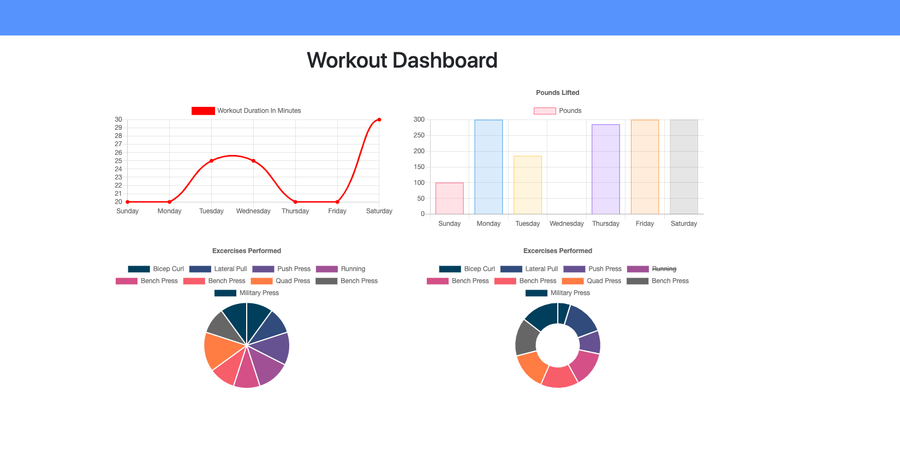

  # Workout Tracker

  ## Table of Contents

  - [Description](#description)
  - [Image](#image)
  - [Business Context](#businesscontext)
  - [Deployment](#deployment)
  - [Contributors](#contributors)
  - [Contact](#contact)

 

  ## Description

  This application uses a Mongo database with a Mongoose schema to handle routes with Express. You can add exercises to a new or previous workout plan and then view the combined weight of multiple exercises. 

  
  

   ## Busines Context

  A consumer will reach their fitness goals more quickly when they track their workout progress.

  ## Deployment
  
  This app is deployed [here](https://workingitout.herokuapp.com/)
  

  ## Contributors

  Jonathan Davila

    
  
  ## Contact:

  For questions about this application please contact me at: 
  - [Github Profile](https://github.com/jdavila10)
  - j.eche589@gmail.com
  
    

